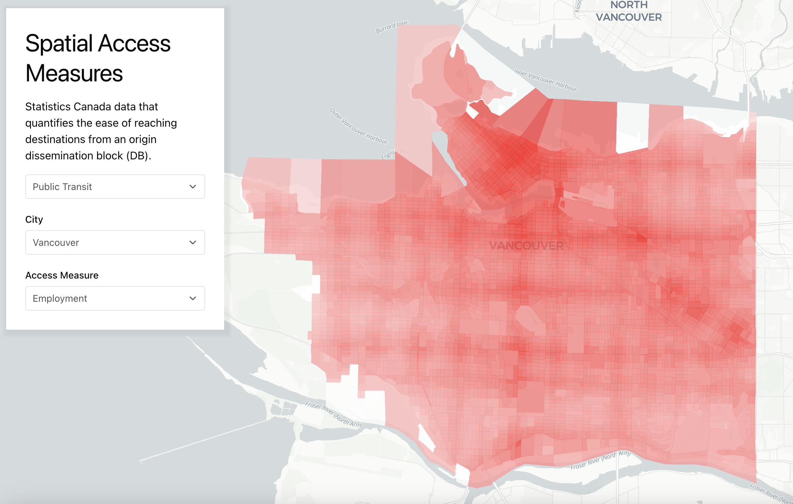

## Spatial Access Measures

Visualizing Statistics Canada [Spatial Access Measure](https://www150.statcan.gc.ca/n1/pub/27-26-0001/272600012023001-eng.htm). The Spatial Access Measures are a set of indicators that quantify the ease of reaching destinations of varying levels of attractiveness from an origin [dissemination block](https://www150.statcan.gc.ca/n1/pub/92-195-x/2021001/geo/db-id/db-id-eng.htm) (DB)

