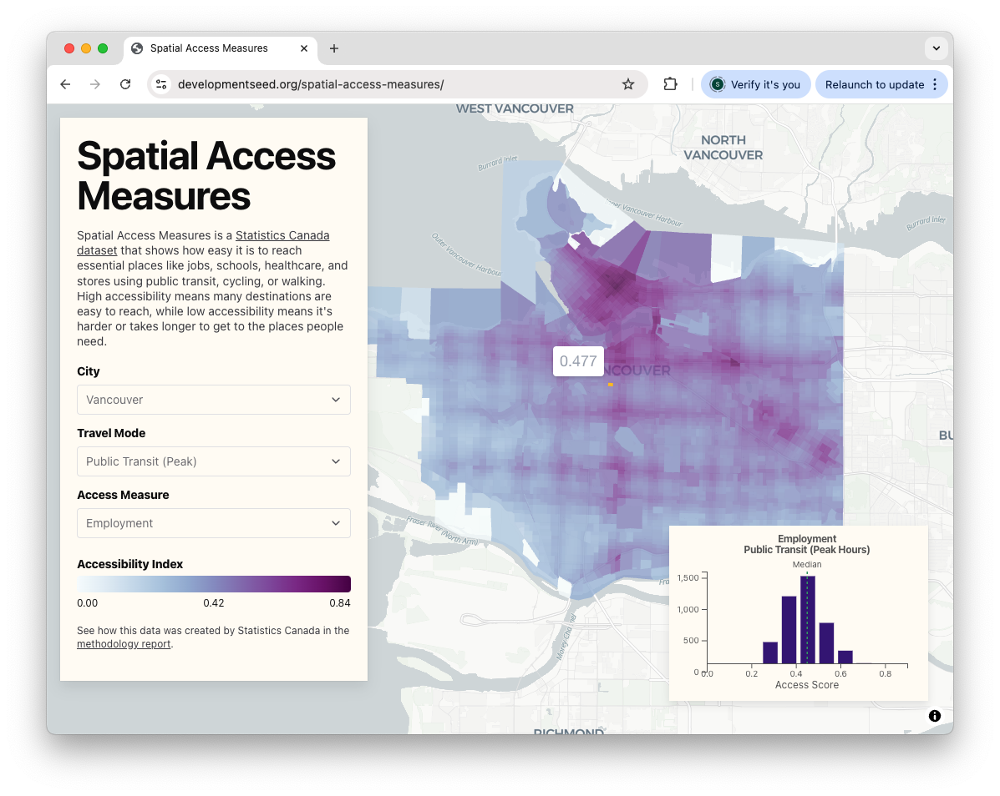

# Spatial Access Measures

Spatial Access Measures is a [Statistics Canada dataset](https://www150.statcan.gc.ca/n1/pub/27-26-0001/272600012023001-eng.htm) that shows how easy it is to reach essential places like jobs, schools, healthcare, and stores using public transit, cycling, or walking. Refer to the [methodology report](https://publications.gc.ca/site/eng/9.939806/publication.html) to see how the data was created.

This project demonstrates how to convert static data formats such as CSV into cloud-native GeoParquet and build an in-browser analytics tool powered by [DuckDB-WASM](https://duckdb.org/docs/stable/clients/wasm/overview.html), without relying on a backend database or APIs.

## Data Transformation
See the [notebooks](/notebooks/) directory for Jupyter notebooks on how CSV data was transformed into WKB encoded GeoParquet files.

## Technical Details

The app involved working with various libraries including DuckDB-WASM, geoarrow-js and deck.gl. See full technical implementation details [here](./Technical.md). 

## Run Locally

Minimum Node 23 required. Install Node version using [nvm](https://github.com/nvm-sh/nvm).

- `pnpm install` to install node  modules 
- `pnpm dev` run local development server